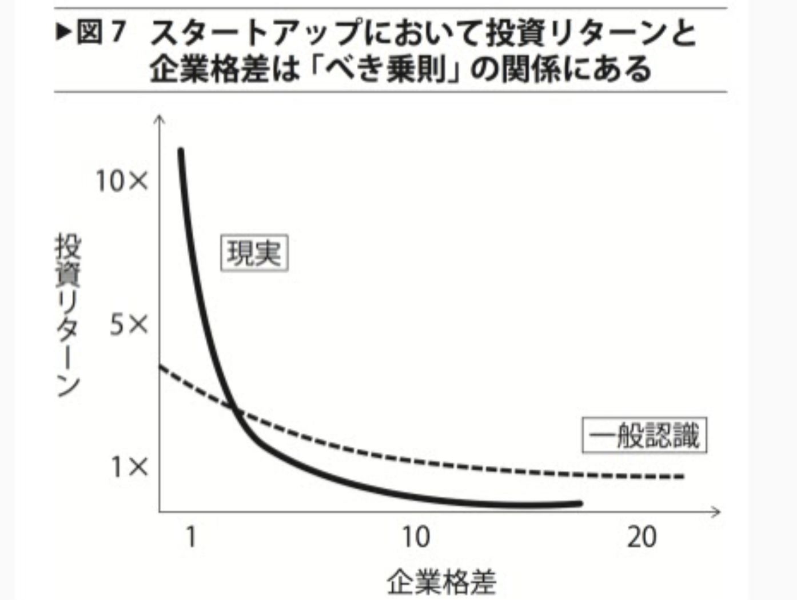

<!-- classes: title -->

# ZERO to ONEを読んでみた

<!-- block-start: grid -->
<!-- account: twitter, your-account-name -->
<!-- block-end -->

---
# 「もし本気で長期的な人類の発展を望むなら、ただの140 文字や“永遠の15 分” を超えた未来について考えなければならない。ZERO to ONE はシリコンバレーを教科書に、難題を克服してこれまで存在し得なかった偉大な物事を築きあげるための本だ」

---
# 賛成する人がほとんどいない、大切な真実はなんだろう？

---

# ほとんどの人はグローバリゼーションが世界の未来を左右すると思っているけれど、実はテクノロジーの方がはるかに重要

---

# テクノロジーが0から1を生み出す

---

# テクノロジーは人間の根源的な能力を押し上げ、より少ない資源でより多くの成果を可能にしてくれる

---

# シリコンバレーでの教訓

* 少しずつ段階的に前進すること
* 無駄なく柔軟であること
* ライバルのものを改良すること
* 販売ではなくプロダクトに集中していること

---
# 真実は逆の原則

* 小さな違いを追いかけるより大胆に賭けた方がいい
* 出来の悪い計画でも、ないよりはいい
* 競争の激しい市場では収益が消失する
* 販売はプロダクトと同じくらい大切だ

---
# 競争ではなく独占

---
# 競争はイデオロギー

---

* 競争は存在しないチャンスがあるような妄想を抱かせる
* 競争は価値の証でなく破壊的な力

---

# 企業価値はその企業が将来生み出すキャッシュフローの総和（ラストムーバーになる）

---
# このビジネスは10年後も存続しているか

---

# 独占企業の特徴
- プロプライエタリ・テクノロジー
- ネットワーク効果
- 規模の経済
- ブランディング

---
# べき乗則

---
# 誰も築いていない、価値ある企業とはどんな企業だろう？

---
# マフィアの力学

* ペイパルマフィア
* 一緒にともに働いて使命を共有

---
# 販売は重要

* 「いいものを作れば売れる」わけではない
* どう売るかも考える

---
# 人間と機械

* テクノロジーやコンピュータは人間を補完するもの
* 補完関係からビジネスを考える

---

<!-- section-title: Bye👋 -->

## Bye👋
